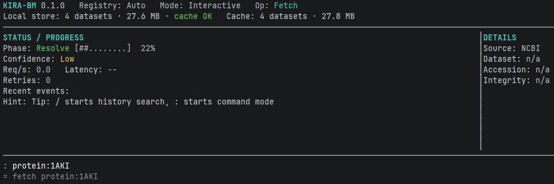
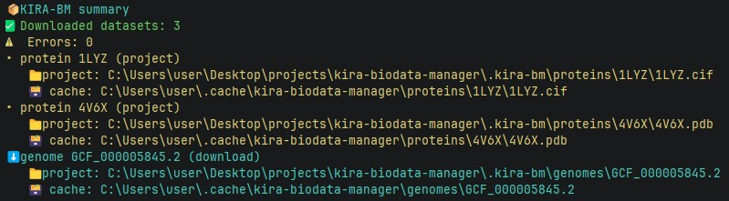

# kira-biodata-manager (kira-bm)

Reproducible bio-data manager with a project-local store and a shared global cache.
`kira-bm` it's like npm/cargo/pip for bioinformatics.

## Prerequisites

- Rust 1.91+ (Edition 2024)
- Network access to NCBI + RCSB PDB APIs (since they provide CC0 public domain datasets)

## Installation

Install from crates.io (Rust 1.91+ / Windows / Linux / MacOS):

```bash
cargo install kira-biodata-manager
```

Or

Build from source (Rust 1.91+):

```bash
cargo build --release
```

## Config (`kira-bm.json`)

It's like `package.json`/`Cargo.toml`

```json
{
  "schema_version": 1,
  "proteins": [
    "1LYZ",
    { "id": "4V6X", "format": "pdb" }
  ],
  "genomes": [
    {
      "accession": "GCF_000005845.2",
      "include": ["genome", "gff3", "protein", "seq-report"]
    }
  ]
}
```

Notes:
- `schema_version` defaults to `1` if omitted.
- Protein format defaults to `cif`. Supported: `cif`, `pdb`, `bcif`.
- Genome `include` defaults to `["genome","gff3","protein","seq-report"]`.

## Usage

Fetch from config (`kira-bm.json`) in the current directory:

```bash
kira-bm data
or just
kira-bm
```

In case you have no `kira-bm.json` file in project and run `kira-bm` -- you'll see an interactive terminal user interface.


Fetch a specific dataset (add dataset to project's dataset directory):

```bash
kira-bm data fetch protein:1LYZ
kira-bm data fetch genome:GCF_000005845.2
```

Routing:
- Protein structures (`protein:<PDB_ID>`) are fetched from RCSB PDB.
- Genomes are fetched from NCBI.



List datasets (JSON in non-interactive mode):

```bash
kira-bm data list --non-interactive
```

Show dataset info:

```bash
kira-bm data info protein:1LYZ --non-interactive
```

Clear project store:

```bash
kira-bm data clear
```

## Storage layout

Project store:

```
./.kira-bm/
  proteins/<ID>/<ID>.<ext>
  proteins/<ID>/metadata.json
  proteins/<ID>/metadata.raw.json
  genomes/<ACCESSION>/...
  metadata/<TYPE>/<ID>.json
```

Global cache:

```
~/.cache/kira-biodata-manager/
  proteins/<ID>/<ID>.<ext>
  proteins/<ID>/metadata.json
  proteins/<ID>/metadata.raw.json
  genomes/<ACCESSION>/...
  metadata/<TYPE>/<ID>.json
```

## Output contracts

`--non-interactive` mode:
- `data list` and `data info` output JSON to stdout.
- `data fetch` and `data clear` output JSON summaries.
- Errors go to stderr with non-zero exit codes.
